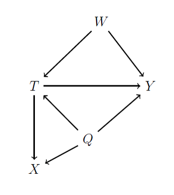

<style type="text/css">
  body{
  font-size: 14pt;
}
</style>


```{r,echo=FALSE,error=FALSE,warning=FALSE, message=FALSE}
library(tidyverse)
library(kableExtra)
```

\DeclareMathOperator{\Lagr}{\mathcal{L}}
\DeclareMathOperator{\sumn}{\sum_{i=1}^n}
\DeclareMathOperator{\bh}{\hat{\beta}}
\DeclareMathOperator{\yh}{\hat{y}}
\DeclareMathOperator{\ybar}{\bar{y}}
\DeclareMathOperator{\xbar}{\bar{x}}

\

\

# Instructions

Complete the exercises below. Be sure to show all of your work. For this assignment, you can submit:

- A PDF containing your written answers, tables, and figures along with the R script that generates them
- A R Markdown document containing your written answers with the R code embedded in the document. 

\

\

# Q1 - Directed Acyclic Graphs


<center>
{width=40%}
</center>

\

## Q1a

**Assume that you are interested in the relationship between $T$ and $Y$ and that $T$ only takes values of zero or one. What would happen if you chose to estimate this relationship by comparing the sample average of $Y$ among observations where $T=1$ to the sample average of $Y$ among observations where $T=0$?** 


\

\


## Q1b

**Using conditional expectations, write out the ideal comparison to identify the relationship between $T$ and $Y$.**


\

\


# Q2 - Calculating Probabilities with Known Distributions

\

##  Q2a

**Consider a random variable $X$, where $X \sim N(0,1)$. Use R to find $Pr(X \leq 1.64)$.**

\

\


## Q2b

**Consider a random variable $X$, where $X \sim N(42,8)$. Use R to find $Pr(X \geq 30)$.**

\

\


##  Q2c
**Consider a random variable $X$, where $X \sim N(0,1)$. Use R to find $Pr(|X| \geq 1.64)$.**


\

\


##  Q2d
**Consider a random variable $X$, where $X \sim N(0,1)$. Use R to find $Pr(X \leq -1.64 \cup X \geq 2.5)$.**


\

\


# Q3 - The Age of UMaine Students

**Download the `E2data.RData` data set and load it in R. Assume that the observations in the \textit{universe} data frame represent the entire population of UMaine students. Assume that the true average age ($\mu$) of a UMaine student is 22.**

\

##  Q3a

**Consider the three estimators proposed below. Show whether each estimator is unbiased. Which one is the most efficient?**


\
\


##  Q3b

**Draw a sample of 25 observations from the \textit{universe} data frame. Using the sample, calculate an estimate of $\mu$ using $\bar{y}$, $\tilde{y}$ and $\hat{y}$. Report your estimates. Which one is the closest to the true value of $\mu$?**


\
\


# Q4 - Hypothesis Testing

**Imagine that you are interested the effect of going on a daily jog ($\hat{\beta}$) and life expectancy.** 

- **You estimate $\hat{\beta} = 6.25$ after analyzing a sample of 502 observations.** 

- **The standard error of your estimate is 1.43.** 

\


## **Q4a Test the following null hypotheses against the alternative, assuming you are willing to accept a 5\% chance of committing a Type I error:**

\


- **$H_0: \: \beta=9.25$**
	
- **$H_0: \: \beta=2.1$**

- **$H_0: \: \beta=3.5$**

\
\

##  **Q4b Still using the estimate from above, construct the following confidence intervals. Plot the confidence intervals in R and be sure to interpret each interval in words.**

\
\


##  **Q4c What is the smallest sized test for which you would reject the null hypotheses $H_0: \: \beta=4$**


\
\


##  **Q5a - Using the full sample, calculate an estimate of $\hat{\gamma}$.**

\
\

##  **Q5b - Calculate the standard error associated with your estimate.**

\
\

## **Q5c - Test the hypothesis that studying hard has no effect on GPA**

\
\

##  **Q5d - Construct and discuss a 95 \% confidence interval around your estimate of $\hat{\gamma}$ **

\
\


# **Q6...Conditional on the library**

**Repeat the tasks from Q5a, Q5b, and Q5d, but this time focus only on students who know where the library is. Compare and contrast your results to those you obtained in Q5.**


\
\
\
\

