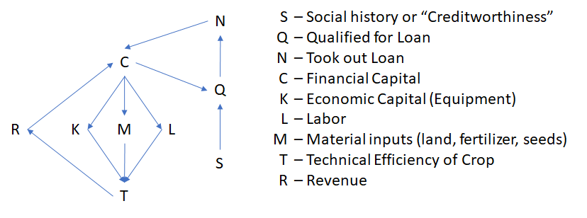

```{r,echo=FALSE,message=FALSE,warning=FALSE}
library(modelsummary)
library(tidyverse)
library(lmtest)
library(sandwich)
library(estimatr)
library(vtable)
library(kableExtra)


## Graph Stuff
cbPalette <- c("#999999", "#E69F00", "#56B4E9", "#009E73", "#F0E442", "#0072B2", "#D55E00", "#CC79A7")
cbPalettet <- c("#99999950", "#E69F0050", "#56B4E950", "#009E7350", "#F0E44250", "#0072B250", "#D55E0050", "#CC79A750")

# File path stuff
datapath <- "F:/Users/Devan/Documents/Education/ECO530/eco530/Exercise 3/data"
scriptpath <- "F:/Users/Devan/Documents/Education/ECO530/eco530/Exercise 3/scripts"
tablesfigurespath <- "F:/Users/Devan/Documents/Education/ECO530/eco530/Exercise 3/tables and figures"

```

<style type="text/css">
  body{
  font-size: 14pt;
}
</style>

\DeclareMathOperator{\Lagr}{\mathcal{L}}
\DeclareMathOperator{\sumn}{\sum_{i=1}^n}
\DeclareMathOperator{\bh}{\hat{\beta}}
\DeclareMathOperator{\yh}{\hat{y}}
\DeclareMathOperator{\ybar}{\bar{y}}
\DeclareMathOperator{\xbar}{\bar{x}}
\usepackage{amsmath}

# Instructions

Complete the exercises below using the Nicaragua Rural Business Development Data (NicaRBD.RData). Be sure to show all of your work. For this assignment, you can submit:

- A PDF containing your written answers, tables, and figures along with the R script that generates them

- A PDF document containing your written answers with the R code embedded in the document. 


\


\


# Q1 

**In this assignment, we are going to explore the relationship between technical efficiency in maize production (`te_maize`) and food expenditure (`food.expend`). We will also consider the relationships between access to credit (`couldgetloan`), holding formal land title (`writtentitle`) and food expenditure**.

\

**Begin by creating a dataframe for which there are no missing observations in the variables on which we will base our analysis (`te_maize`,`food.expend`,`couldgetloan`,`writtentitle`)**

\
```{r}
# Sets the working directory to data folder and loads the nicaRBD.RData file into
# R
data_load <- paste(datapath,"/nicaRBD.RData",sep = "")
load(data_load)

# Creates a data frame for use in the assignment that filters out NA values in the
# four variables of interest from the nica.rbd data frame
e3_data <- filter(nica.rbd,!is.na(te_maize) & !is.na(food.expend) & !is.na(couldgetloan) & !is.na(writtentitle))

```
\

\


\

**Now, summarize the technical efficiency and food expenditure variables for me. You should do this in the form of a paragraph. Please also present a table or figure. Your table or figure should treat each variable separately.**

\
The te_maize and food.expend variables represent the technical efficiency of maize and the per capita expenditure on food using 2005 U.S. dollars. The technical efficiency of maize is strictly less than one in the observations, ranging from 0.1578 to 0.8598. This is a measurement of the input/output efficiency of the crop, with 0 representing no output and 1 representing optimal output given the inputs. The per capita food expendature variable is a bit more straightforward in its meaning - that is, the variable represents the per person food expenditures in 2005 U.S. dollars. The values observed range from 92.86 to 7,428.05. Both variables can be observed in the summary tables below:
\
```{r,echo=FALSE}
# Creates a table of summary statistics for te_maize and food.expend as a kable table then 
# displays in viewer
maize_food_sum <- st(e3_data,vars = c("te_maize","food.expend"),out = "kable",digits=2) %>% kable_classic()
maize_food_sum
```
\

\

\

**After you have summarized each variable separately, create a scatter plot depicting the relationship between technical efficiency in maize production and food expenditure. Describe any relationship visible in your plot in a few sentences.**

\
Below is a scatter plot of te_maize and food.expend on the x and y axes, respectively. There appears to be a slight positive correlation between the variable, indicating that increases in te_maize is associated with increases in food.expend. 
\
```{r,echo=FALSE}
# Creates a scatter plot with te_maize on the x axis and food.expend on the y
maize_food_plot <- ggplot(data=e3_data, aes(x=te_maize,y=food.expend)) + geom_point() +
                      xlim(0,0.9) + ylim(0,7500)
maize_food_plot
```

\

\

\

# Q2

**We want to study:**

$$E[f_i|te_i] = \beta_0 + \beta_1 te_i$$

**Where, $f_i$ is food expenditure for individual $i$ and $te_i$ is the technical efficiency measure for individual $i$. Building off our usual model:**

$$ f_i = E[f_i|te_i] + \epsilon_i$$

$$\begin{equation} 
\tag{1} \label{eqn:q2}
	f_i = \beta_0 + \beta_1 te_i + \epsilon_i
\end{equation}$$

**Using Ordinary Least Squares, estimate Equation \ref{eqn:q2}. Interpret your estimate of $\bh_1$ in words. Present your results in both a table and using a coefficient plot. In your table, please limit the "statistics" reported at the bottom to only the number of observations (N).**


\
The results of my OLS regression of te_maize on food.expend are displayed below. From this model, we can see that a 1 unit increase of te_maize is associated with an approximately 974 unit increase in food expenditure.

\
```{r}
# Performs a linear regression of te_mmaize on food.expend
reg_1 <- lm_robust(food.expend~te_maize,data = e3_data)
# Adds the model to a list that can be called later in the exercise
e3_fe_models <- list("Model 1"=reg_1)

# Updates the model table with the model summary from e3_models as a kable table
# including only the number of observations as additional information to the 
# model
fe_model_table <- modelsummary(e3_fe_models,output = "kableExtra",gof_map = "nobs",title = "Food Expenditures") %>% kable_classic()
# Reports the model_table object
fe_model_table

# Creates a coefficient plot for the reg_1 model and reports it to the user
reg_1_plot <- modelplot(reg_1,coef_omit = "Intercept") + labs(title="Coefficients for Model\nTE Maize on Food Expendature")
reg_1_plot
```
\

\

\


# Q3 

**Estimate the following two relationships separately.**

- **How does having credit access (couldgetloan=1) relate to food expenditure?**

- **How does having formal title to your land (writtentitle=1) relate to food expenditure?**

- **Caution: You will need to make some changes to the writtentitle variable prior to running your regression. **


\

**Present the results of both specifications in either a table or a coefficient plot. Discuss both estimates. Which is associated with a larger change in food expenditure?**


\
Below are the results of Model 2 (couldgetloan) and Model 3 (writtentitle). In both cases, the indicator variable (couldgetloan or writtentitle) is associated with increases to the y-intercept of the model. In Model 2, couldgetloan is associated with an increase of 203 units to the intercept, and in Model 3 we find that writtentitle is associated with a 184 unit increase to the intercept. Thus, the ability to access credit (couldgetloan=1) is associated with a larger increase in food expenditures. 
\
```{r}
# Changes the values in the writtentitle variable to 1 for true and 0 for false to 
# allow for inclusion into our model. I use a for loop here so that I can run the
# code multiple times and still have the working data in e3_data correct, as the values
# reference a data frame that has not been manipulated. 
e3_data$writtentitle <- as.integer(e3_data$writtentitle) - 1


# Runs regression models for the dependent variable food.expend conditioned on 
# couldgetloan in reg_2 and writtentitle in reg_3
reg_2 <- lm_robust(food.expend~te_maize+couldgetloan,data = e3_data)
reg_3 <- lm_robust(food.expend~te_maize+writtentitle,data = e3_data)

# Adds the above models to the e3_models list
e3_fe_models <- list("Model 1"=reg_1,"Model 2"=reg_2,"Model 3"=reg_3)

# Updates the model table with the model summary from e3_models as a kable table
# including only the number of observations as additional information to the 
# model
fe_model_table <- modelsummary(e3_fe_models,output = "kableExtra",gof_map = "nobs",title = "Food Expenditures") %>% kable_classic()
# Reports the model_table object
fe_model_table

```
\

\

\


# Q4

**Use Ordinary Least Squares to estimate the relationship depicted below:**

$$te_i = \gamma_0 + \gamma_1 loan_i + v_i$$

**Where $te_i$ is the technical efficiency in maize production for individual $i$ and $loan_i$ is equal to one if individual $i$ could obtain a formal loan.**

\

**Present and discuss your results.**

\
Below is a regression model created in R to describe the above relationship. Before I continue, I would like to discuss the choice of variables in the model. In the model below, we look at the association between the couldgetloan variable and the te_maize variable. Although availible in our data, this model is not looking at the association of *having* a loan, but instead being *able* to get one. Thus, the model only considers the possiblity instead of the tangability of the loan.

From the model below, we can see that having a couldgetloan value of 1 is associated with a 0.036 increase to the technical efficiency of maize. This means that, on average, a farmer having access to a loan was associated with a 0.036 increase to their ability to convert the inputs of the maize crop into crop yield. 
\
```{r}
# Below code regresses couldgetloan on te_maize. The variable couldgetloan is used
# here instead of hadloan we are looking to understand the association between 
# loan availability for individual i and the technical efficiency of their maize
# crops. If instead we wanted to know what the association between having a loan
# and the technical efficiency of the maize crops was then we would employ the
# hadloan variable. 
reg_4 <- lm_robust(te_maize~couldgetloan,data = e3_data)

# Added the te_maize model to a seperate list for reporting
e3_te_models <- list("Model 1"=reg_4)
# Created a table for te_maize as the dependent variable, similar to the tables created
# in prior problem for food.expend. 
te_model_table <- modelsummary(e3_te_models,output = "kableExtra",gof_map = "nobs",title = "Technical Efficiency of Maize") %>% kable_classic()
# Reports table to the user
te_model_table
```
\

\

\


# Q5

**One way to represent the relationship you estimated in Q4 is as**

$$\gamma_1 = E[te_i|loan_i = 1] - E[te_i|loan_i =0]$$

**Do you think the $\hat{\gamma}_1$ you obtained in $Q4$ is a good estimate of the relationship between credit access and technical efficiency? Draw a DAG to support your position.**


\
Based on my understanding of the system we are seeking to describe, I do not think that our estimate of the true relationship between credit access and technical efficiency. Below is a Directed Acyclic Graph (DAG) that I will use to outline my position:
\


\
As I have outlined, the ability for individual i to qualify for a loan they typically need to have established financial capital and some measure of trustworthiness to allow for the issuing authority to be confident that they will recuperate their funds. Financial capital can be increased by taking a loan, and financial capital is used to purchase economic capital in the form of durable goods (tools, equipment, etc.), purchase the raw inputs for the crop (land, fertilizer, seeds, etc.), and pay for additional labor costs. These factors all then influence the technical efficiency of the crop, which itself then leads to the revenues a farmer can expect to receive. These revenues are added back into the farmer's financial capital, which itself is part of the base used to establish loan eligibility. Thus, we see that in the system I have outlined that since revenue is determined by technical efficiency and influences the ability for a farmer to qualify for a loan there exists a confounding element within our model. 

However, if the loan program the farmers were utilizing in this data was a special program that did *not* consider other financial elements when making a decision on credit then the estimate derived might in fact be a good representation of the desired relationship. However, with the limited information regarding situation specifics available, the assumptions made are assumed to be valid. 
\

\

\


